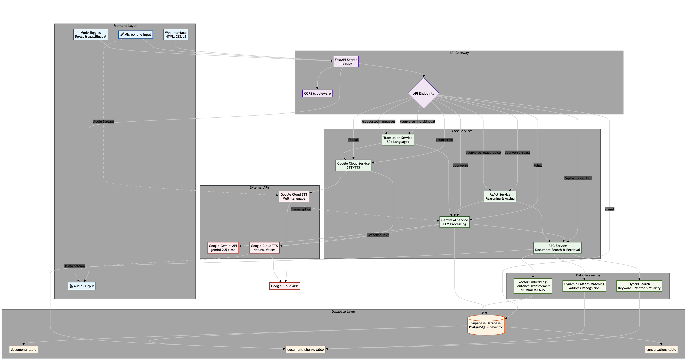

# Multi-Agentic Conversational AI System

A sophisticated conversational AI system with voice capabilities, multilingual support, and ReAct (Reasoning and Acting) functionality. Built with FastAPI, Supabase, and Google AI services.

## 🏗️ Architecture Overview



## ✨ Key Features

- **🎤 Voice Conversation**: Real-time speech-to-text and text-to-speech
- **🌍 Multilingual Support**: 50+ languages with automatic translation
- **🤖 ReAct Mode**: Reasoning and Acting for complex problem-solving
- **📚 RAG (Retrieval-Augmented Generation)**: Document-based knowledge retrieval
- **🔄 Context Switching**: Seamless mode transitions with context preservation
- **📊 Hybrid Search**: Combines keyword matching and vector similarity
- **🎯 Dynamic Pattern Matching**: Flexible address and entity recognition
- **📱 Modern Web UI**: Responsive interface with real-time feedback

## 🚀 Quick Start

### Prerequisites

- Python 3.8+
- HTML/CSS/JS(for frontend development)
- Supabase (vector Database)
- Google Cloud Platform account
- Google Gemini API access

### 1. Clone Repository

```bash
git clone <repository-url>
cd Hackathon
```

### 2. Install Dependencies

```bash
pip install -r requirements.txt
```

### 3. Google Cloud Setup

1. Create a Google Cloud project
2. Enable Speech-to-Text and Text-to-Speech APIs
3. Create a service account and download the JSON key
4. Place the service account JSON file in your project root
5. Update the path in your `.env` file

### 4. Start the Application

#### Backend Server

```bash
# Development mode
python run.py

# Or using uvicorn directly
uvicorn app.main:app --reload --host 0.0.0.0 --port 8000
```

#### Frontend Server

```bash
cd frontend
python start.py
```

## 📖 Usage Guide

### Web Interface

1. **Open the web interface** at http://localhost:3000
2. **Choose your mode**:
   - **Regular Chat**: Standard text/voice conversation
   - **ReAct Mode**: Advanced reasoning and problem-solving
   - **Multilingual**: Automatic language detection and translation
3. **Start conversing**:
   - Type messages in the text input
   - Use microphone button for voice input
   - Toggle between modes seamlessly

### API Endpoints

#### Core Endpoints

- `POST /chat` - Text-based conversation
- `POST /transcribe` - Speech-to-text conversion
- `POST /speak` - Text-to-speech conversion
- `POST /converse` - End-to-end voice conversation
- `POST /converse_multilingual` - Multilingual voice conversation
- `POST /converse_react` - ReAct mode text conversation
- `POST /converse_react_voice` - ReAct mode voice conversation

#### Document Management

- `POST /upload_rag_docs` - Upload documents for RAG
- `POST /clear_rag_docs` - Clear all documents

#### Utility Endpoints

- `GET /supported_languages` - List supported languages
- `POST /reset` - Reset conversation session
- `GET /` - Health check and system status

### Example Usage

#### Text Chat

```bash
curl -X POST "http://localhost:8000/chat" \
  -H "Content-Type: application/json" \
  -d '{
    "message": "What properties do you have available?",
    "session_id": "user123"
  }'
```

#### Voice Conversation

```bash
curl -X POST "http://localhost:8000/converse" \
  -F "audio=@recording.wav" \
  -F "session_id=user123"
```

#### Upload Documents

```bash
curl -X POST "http://localhost:8000/upload_rag_docs" \
  -F "files=@document1.pdf" \
  -F "files=@document2.txt"
```

## 🔧 Configuration

### Environment Variables

| Variable | Description | Default |
|----------|-------------|---------|
| `SUPABASE_URL` | Supabase project URL | Required |
| `SUPABASE_ANON_KEY` | Supabase anonymous key | Required |
| `GEMINI_API_KEYS` | Google Gemini API keys (comma-separated) | Required |
| `GEMINI_MODEL` | Gemini model to use | `gemini-2.5-flash` |
| `GOOGLE_CLOUD_PROJECT_ID` | Google Cloud project ID | Required |
| `GOOGLE_CLOUD_SERVICE_ACCOUNT_PATH` | Path to Google Cloud service account JSON file | Required |
| `GOOGLE_CLOUD_DEFAULT_VOICE` | Default Text-to-Speech voice | `en-US-Standard-A` |
| `GOOGLE_CLOUD_LANGUAGE_CODE` | Default language code for Google Cloud services | `en-US` |
| `EMBEDDING_MODEL` | Sentence transformer model for embeddings | `all-MiniLM-L6-v2` |
| `CHUNK_SIZE` | Size of document chunks for RAG | `1000` |
| `CHUNK_OVERLAP` | Overlap between document chunks for RAG | `200` |
| `TOP_K_RESULTS` | Number of top RAG results to retrieve | `5` |
| `API_TITLE` | Title for the FastAPI application | `Voice Conversational Agentic AI` |
| `API_VERSION` | Version of the FastAPI application | `1.0.0` |
| `DEBUG` | Enable/disable debug mode | `false` |
| `MAX_FILE_SIZE` | Maximum allowed file size for uploads in bytes | `10485760` |
| `ALLOWED_FILE_TYPES` | Comma-separated list of allowed file extensions for upload | `pdf,txt,csv,json,docx,doc` |
| `MAX_CONVERSATION_HISTORY` | Maximum number of conversation messages to store | `20` |

### Voice Configuration

Available Google Cloud voices:
- `en-US-Standard-A` (Female)
- `en-US-Standard-B` (Male)
- `en-US-Standard-C` (Female)
- `en-US-Standard-D` (Male)
- `en-US-Wavenet-A` (Female, premium)
- `en-US-Wavenet-B` (Male, premium)

## 🧪 Testing

### Run Tests

```bash

# Test API endpoints
python test_api.py

# Test CSV processing
python test_csv_processing.py

# Test hybrid search
python test_hybrid_search.py
```

### Debug Tools

```bash
# Debug embedding functionality
python debug_embedding.py

# Debug RAG search
python debug_rag.py

# Debug search functionality
python debug_search.py
```

## 🛠️ Development

### Project Structure

```
Hackathon/
├── app/
│   ├── __init__.py
│   ├── main.py              # FastAPI application
│   ├── config.py            # Configuration settings
│   ├── models.py            # Pydantic models
│   ├── services/
│   │   ├── gemini_service.py
│   │   ├── google_cloud_service.py
│   │   ├── rag_service.py
│   │   ├── react_service.py
│   │   ├── supabase_service.py
│   │   └── translation_service.py
│   └── utils/
│       └── performance.py
├── frontend/
│   ├── index.html
│   ├── css/style.css
│   ├── js/app.js
│   └── start.py
├── database/
│   └── supabase_schema.sql
├── requirements.txt
├── .env
└── README.md
```

### Adding New Features

1. **Create service module** in `app/services/`
2. **Add models** in `app/models.py`
3. **Create endpoint** in `app/main.py`
4. **Update frontend** if needed
5. **Add tests** for new functionality

### Code Style

- Follow PEP 8 guidelines
- Use type hints
- Add docstrings to functions
- Handle errors gracefully
- Log important events

## 🚨 Troubleshooting

### Common Issues

#### 1. Database Connection Error
```
Error: Could not connect to Supabase
```
**Solution**: Check your `SUPABASE_URL` and `SUPABASE_ANON_KEY` in `.env`

#### 2. Google Cloud Authentication Error
```
Error: Could not authenticate with Google Cloud
```
**Solution**: Verify your service account JSON file path and permissions

#### 3. Embedding Model Download Error
```
Error: Could not download embedding model
```
**Solution**: Check internet connection and try again. Model downloads automatically on first use.

#### 4. Voice Recording Not Working
```
Error: Microphone access denied
```
**Solution**: Grant microphone permissions in your browser settings

#### 5. ReAct Mode Not Responding
```
Error: ReAct processing failed
```
**Solution**: Check if documents are uploaded and RAG service is working

### Debug Mode

Enable debug logging by setting:
```python
logging.basicConfig(level=logging.DEBUG)
```

### Performance Optimization

- Use connection pooling for database
- Implement caching for embeddings
- Optimize vector search parameters
- Use async operations where possible

## 📄 License

This project is licensed under the MIT License - see the LICENSE file for details.

## 🤝 Contributing

1. Fork the repository
2. Create a feature branch
3. Make your changes
4. Add tests
5. Submit a pull request

## 📞 Support

For issues and questions:
- Check the troubleshooting section
- Review the API documentation at `/docs`
- Create an issue in the repository

---

**Built with ❤️ using FastAPI, Supabase, and Google AI**
